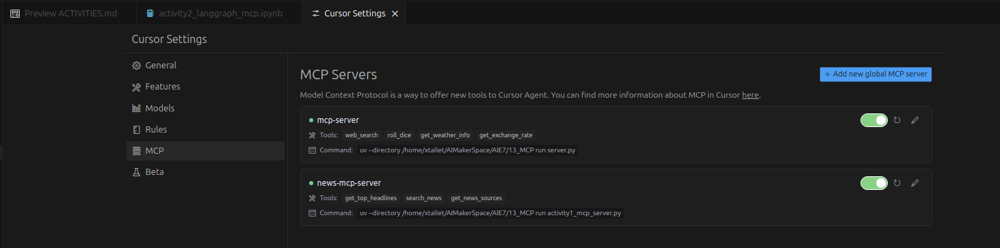

## 📚🧪 MCP Learning Exercises & Activity Tracker | 🏗️ XTALLET

### 3. 🏗️ **Add a new tool to your MCP Server** 🏗️

##### ✅ Answer:
I have added two new tools to the [`server.py`](server.py) file.
One tool to get info about the weather and the other one to get the exchange rate given a currency.

Tool : 🌤️ get_weather_info

- What it does: This tool provides current weather information for any location worldwide. 

- It searches the web for real-time weather data and returns comprehensive weather details for the specified location.

- API used: Tavily Search API - This tool leverages Tavily's web search capabilities to find current weather information from various weather sources across the internet.

Tool : 💱 get_exchange_rate

- What it does: This tool converts between different currencies using real-time exchange rates. 

- It can convert any amount from one currency to another, providing both the converted amount and the current exchange rate.

- API used: Exchange Rate API (exchangerate-api.com) - A free, reliable API that provides up-to-date currency exchange rates for over 150 currencies worldwide.

 

### 🏗️ Activity #1: 

Choose an API that you enjoy using - and build an MCP server for it!

##### ✅ Answer:

My code related with this activity can be found into the file [`activity1_mcp_server.py`](activity1_mcp_server.py).

MCP Server : 📰 News MCP Server
- This MCP server provides comprehensive news functionality by integrating with the News API. 
- It allows us to access top headlines, search for specific news articles, and discover available news sources from around the world. 
- The server is designed to make news consumption and research more accessible and efficient.

It has 3 tools available :

Tool : 📊 get_top_headlines

- What it does: This tool retrieves the latest top headlines from a specific country, with an optional category filter. 
- It provides a curated list of the most important news stories currently trending in the selected region.
- API used: News API (newsapi.org) - A comprehensive news aggregation service that provides access to articles from over 80,000 news sources worldwide, including major international publications and local news outlets.

Tool : 🔍 search_news

- What it does: This tool searches for news articles based on specific keywords or topics. 
- It can filter results by language, sort by publication date, and return a customizable number of articles that match the search criteria.
- API used: News API (newsapi.org) - Leverages the same comprehensive news database to search across millions of articles from various sources and time periods.

Tool : 📰 get_news_sources
- What it does: This tool provides a list of available news sources for a specific country, with an optional category filter. 
- It helps users discover reliable news outlets and understand the available sources for different regions and topics.
- API used: News API (newsapi.org) - Uses the same API to access information about news sources, their descriptions, and categorization.

 

### 🏗️ Activity #2: 

Build a simple LangGraph application that interacts with your MCP Server.

You can find details [here](https://github.com/langchain-ai/langchain-mcp-adapters)!

##### ✅ Answer:

<b>IMPORTANT NOTE :</b> I have been running my code into the Jupyter Notebook [`activity2_langgraph_mcp.ipynb`](activity2_langgraph_mcp.ipynb) to provide more visual logs like, Graph diagram, and formating response outputs from the tools.

🔗 **LangGraph MCP Integration Application**

🤖 This Jupyter notebook demonstrates how to build a LangGraph application that seamlessly integrates with my custom MCP server. 
- The application creates an intelligent conversational AI system that can access news information through the News API, providing users with real-time news headlines, search capabilities, and source discovery. 
- The system uses a state-based graph architecture to manage conversations and tool interactions dynamically, enabling complex workflows that combine AI reasoning with real-time data retrieval.

🧠 The application implements :
- A sophisticated conversation flow management system using LangGraph's StateGraph, which creates a dynamic workflow that can intelligently decide when to use tools, process user queries, and generate responses based on the conversation context. 
- It establishes a connection between the LangGraph application and my custom News MCP server through the MultiServerMCPClient, enabling the AI system to access and utilize the three news-related tools (get_top_headlines, search_news, get_news_sources) that were built in the previous activity.

🛠️ The system features :
- Intelligent tool orchestration that automatically determines which tools to use based on user queries and conversation context. 
- It can seamlessly switch between different news tools and provide contextual responses that combine AI reasoning with real-time data from the News API. 
- The application successfully demonstrates how to create a production-ready AI system that combines the power of LangGraph's conversation management with the flexibility of custom MCP tools, resulting in an intelligent news assistant that can handle complex queries and provide real-time information through natural language interactions.

 

#### 📸 MCP Servers Screenshots
I am going to attach a screenshot of my MCP Server running.

