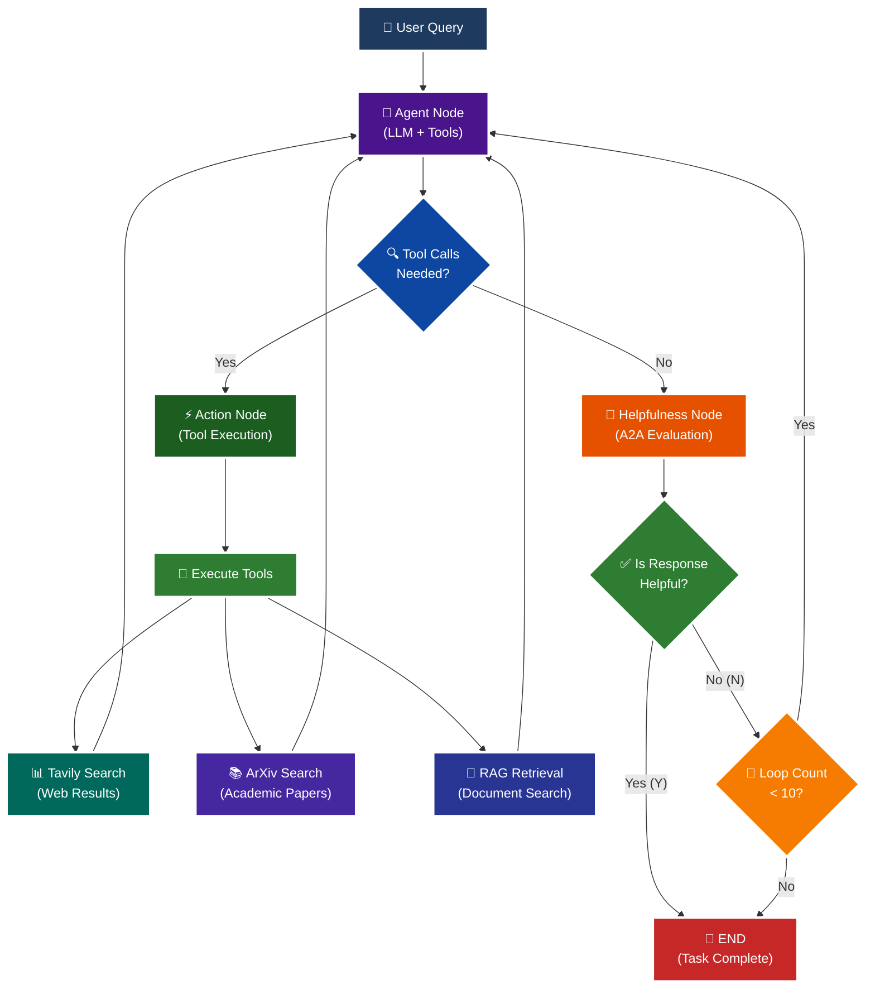

<p align = "center" draggable="false" >
</p>

## <h1 align="center" id="heading">Session 15: Build & Serve an A2A Endpoint for Our LangGraph Agent</h1>

| 🤓 Pre-work | 📰 Session Sheet | ⏺️ Recording     | 🖼️ Slides        | 👨‍💻 Repo         | 📝 Homework      | 📁 Feedback       |
|:-----------------|:-----------------|:-----------------|:-----------------|:-----------------|:-----------------|:-----------------|
| [Session 15: Pre-Work](https://www.notion.so/Session-15-Agent2Agent-Protocol-Agent-Ops-247cd547af3d8066bc5be493bc0c7eda?source=copy_link#247cd547af3d81369191e4e6cd62f875)| [Session 15: Agent2Agent Protocol & Agent Ops](https://www.notion.so/Session-15-Agent2Agent-Protocol-Agent-Ops-247cd547af3d8066bc5be493bc0c7eda) | [Recording!](https://us02web.zoom.us/rec/share/lgZHp8jqB5D5ytsi1gKH-wwdoz6fX0yBlJFOz5tuoGa1TMU0x7e9rKkkH4a75uUx.RC9C31cDG5Bl4UR2) (mttc.$6G)| [Session 15 Slides](https://www.canva.com/design/DAGv5Xxl3Vw/CRpCrhpika6yPjcQHwB_MQ/edit?utm_content=DAGv5Xxl3Vw&utm_campaign=designshare&utm_medium=link2&utm_source=sharebutton) | You are here! | [Session 15 Assignment: A2A](https://forms.gle/RPC6sNh2WXE6984j9) | [AIE7 Feedback 8/12](https://forms.gle/AZT2usWxqzfa1JNc8)

# A2A Protocol Implementation with LangGraph

This session focuses on implementing the **A2A (Agent-to-Agent) Protocol** using LangGraph, featuring intelligent helpfulness evaluation and multi-turn conversation capabilities.

## 🎯 Learning Objectives

By the end of this session, you'll understand:

- **🔄 A2A Protocol**: How agents communicate and evaluate response quality

## 🧠 A2A Protocol with Helpfulness Loop

The core learning focus is this intelligent evaluation cycle:



# Build 🏗️

Complete the following tasks to understand A2A protocol implementation:

## 🚀 Quick Start

```bash
# Setup and run
./quickstart.sh
```

```bash
# Start LangGraph server
uv run python -m app
```

```bash
# Test the A2A Serer
uv run python app/test_client.py
```

### 🏗️ Activity #1:

Build a LangGraph Graph to "use" your application.

Do this by creating a Simple Agent that can make API calls to the 🤖Agent Node above through the A2A protocol.

#### ✅ Answer:
I have completed this activity by creating a simple LangGraph client agent graph that communicates with my existing A2A server through the A2A protocol. The client graph contains a single node that sends user queries to the server, receives responses that include tool executions (web search, academic search, RAG), and returns the processed information back to the user.<br>
NOTE : The Graph Client code can be found here - [activity1_client_agent_graph.py](app/activity1_client_agent_graph.py)

### ❓ Question #1:

What are the core components of an `AgentCard`?

#### ✅ Answer: 

The core components of an `AgentCard` are :<br>
<b>- name :</b> A descriptive name for the agent.<br>
<b>- description :</b> A detailed description of what the agent does and its capabilities.<br>
<b>- url :</b> The endpoint where the agent can be reached.<br>
<b>- version :</b> The version number of the agent.<br>
<b>- defaultInputModes :</b> Supported input formats.<br>
<b>- defaultOutputModes :</b> Supported output formats.<br>
<b>- capabilities :</b> Agent features like streaming and push notifications.<br>
<b>- skills :</b> Specific tools and abilities the agent possesses.<br>

### ❓ Question #2:

Why is A2A (and other such protocols) important in your own words?

#### ✅ Answer: 

A2A is important because it creates a standardized "language" that allows different AI agents to communicate with each other, regardless of how they were built or what framework they use. In my own experience implementing this, I can see how A2A enables my LangGraph client agent to seamlessly talk to my existing A2A server without needing to rewrite or modify the server code. It's like having a universal translator - my client agent can discover what my server agent can do (through the AgentCard), send requests in a format it understands, and receive responses that both agents can interpret. This standardization means I can build new agents that use existing ones, or even have agents from different developers work together, without worrying about compatibility issues. It's essentially the foundation for building a network of interoperable AI agents that can collaborate and share capabilities.

### 🚧 Advanced Build:

<details>
<summary>🚧 Advanced Build 🚧 (OPTIONAL - <i>open this section for the requirements</i>)</summary>

Use a different Agent Framework to **test** your application.

Do this by creating a Simple Agent that acts as different personas with different goals and have that Agent use your Agent through A2A. 

Example:

"You are an expert in Machine Learning, and you want to learn about what makes Kimi K2 so incredible. You are not satisfied with surface level answers, and you wish to have sources you can read to verify information."
</details>

#### ✅ Advanced Build | Answer :

I have implemented an advanced LangChain agent with three distinct personas (academic researcher, tech journalist, and curious student) that communicates with my existing A2A server through the A2A protocol. The agent queries my server, receives responses with tool executions, and presents information according to each persona's unique communication style and goals. This demonstrates seamless interoperability between different agent frameworks using standardized protocols.<br>
NOTE - The code can be found here : [advanced_build_langchain.py](app/advanced_build_langchain.py)

## 📁 Implementation Details

For detailed technical documentation, file structure, and implementation guides, see:

**➡️ [app/README.md](./app/README.md)**

This contains:
- Complete file structure breakdown
- Technical implementation details
- Tool configuration guides
- Troubleshooting instructions
- Advanced customization options

# Ship 🚢

- Short demo showing running Client

# Share 🚀

- Explain the A2A protocol implementation
- Share 3 lessons learned about agent evaluation
- Discuss 3 lessons not learned (areas for improvement)

# Submitting Your Homework

## Main Homework Assignment

Follow these steps to prepare and submit your homework assignment:
1. Create a branch of your `AIE7` repo to track your changes. Example command: `git checkout -b s15-assignment`
2. Complete the activity above
3. Answer the questions above _in-line in this README.md file_
4. Record a Loom video reviewing the changes you made for this assignment and your comparison of the flows (Breakout Room Part #2 - Task 3).
5. Commit, and push your changes to your `origin` repository. _NOTE: Do not merge it into your main branch._
6. Make sure to include all of the following on your Homework Submission Form:
    + The GitHub URL to the `15_A2A_LANGGRAPH` folder _on your assignment branch (not main)_
    + The URL to your Loom Video
    + Your Three lessons learned/not yet learned
    + The URLs to any social media posts (LinkedIn, X, Discord, etc.) ⬅️ _easy Extra Credit points!_

### OPTIONAL: Advanced Build Assignment _(Can be done in lieu of the Main Homework Assignnment)_

Follow these steps to prepare and submit your homework assignment:
1. Create a branch of your `AIE7` repo to track your changes. Example command: `git checkout -b s015-assignment`
2. Complete the requirements for the Advanced Build
3. Record a Loom video reviewing the agent you built and demostrating in action
4. Commit, and push your changes to your `origin` repository. _NOTE: Do not merge it into your main branch._
5. Make sure to include all of the following on your Homework Submission Form:
    + The GitHub URL to the `15_A2A_LANGGRAPH` folder _on your assignment branch (not main)_
    + The URL to your Loom Video
    + Your Three lessons learned/not yet learned
    + The URLs to any social media posts (LinkedIn, X, Discord, etc.) ⬅️ _easy Extra Credit points!_
=======
